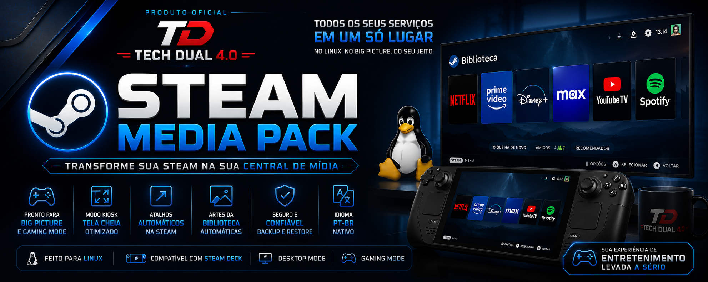
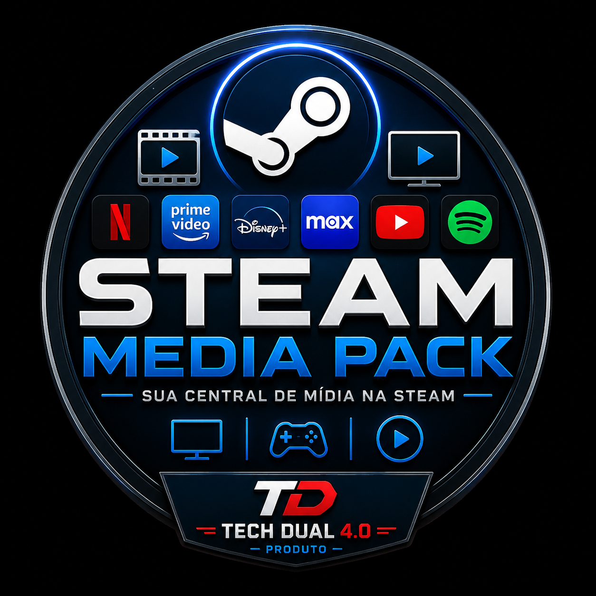

<p align="center">
  
</p>

<p align="center">
  
</p>

<h1 align="center">Steam Media Pack</h1>

<p align="center">
Transforme a Steam na sua central de mídia definitiva para Linux.
</p>

<p align="center">


</p>

---

# 🎮 O que é o Steam Media Pack?

O **Steam Media Pack** é um projeto Open Source desenvolvido pelo **Tech Dual 4.0** que transforma a biblioteca da Steam em uma verdadeira central de entretenimento.

Com apenas alguns cliques você adiciona seus serviços de streaming diretamente à Steam, com:

- Desktop Mode
- Gaming Mode
- Big Picture
- Steam Deck
- Arte automática
- Atalhos automáticos
- Backup seguro
- Restauração automática

Tudo integrado à experiência da Steam.

---

# ✨ Destaques

- 🚀 Integração automática com a Steam
- 🎨 Instalação automática das artes da biblioteca
- 🎮 Compatível com Big Picture
- 🖥️ Desktop Mode e Gaming Mode
- 💾 Backup automático do `shortcuts.vdf`
- 🔄 Restauração dos atalhos
- 🌐 Suporte a navegadores Chromium
- 📺 Launchers otimizados para streaming
- 📦 Instalação simples e rápida
- 🛠️ Projeto Open Source

---

# ✨ Principais Recursos

✅ Integração automática com a Steam

✅ Criação automática de atalhos

✅ Instalação automática das artes da biblioteca

✅ Backup automático do shortcuts.vdf

✅ Restauração do backup

✅ Compatível com Desktop Mode

✅ Compatível com Gaming Mode

✅ Modo Kiosk

✅ Modo App

✅ Modo Auto

✅ Detecção automática de resolução

✅ Limpeza inteligente das variáveis da Steam

✅ Idioma PT-BR

✅ Logs individuais por serviço

---

# 📺 Serviços suportados

| Serviço | Status |
|----------|:------:|
| Netflix | ✅ |
| Prime Video | ✅ |
| Disney+ | ✅ |
| Max | ✅ |
| Spotify | ✅ |
| YouTube TV | ✅ |

---

# 🖥️ Compatibilidade

| Plataforma | Status |
|------------|:------:|
| CachyOS Handheld | ✅ Oficial |
| SteamOS | 🟡 Compatível (não validado oficialmente) |
| Bazzite | 🟡 Compatível (não validado oficialmente) |
| Arch Linux | 🟡 Compatível |
| Nobara | 🟡 Compatível |

---

# 📸 Screenshots

## Biblioteca da Steam

> *(Em breve)*

---

## Gaming Mode

> *(Em breve)*

---

## Desktop Mode

> *(Em breve)*

---

# 🚀 Instalação

Clone o projeto:

```bash
git clone https://github.com/abiason/Steam-Media-Pack.git

cd Steam-Media-Pack
```

Dê permissão aos scripts:

```bash
chmod +x install.sh uninstall.sh diagnostico.sh selecionar-modo.sh
chmod +x launchers/*.sh
chmod +x tools/*.sh
chmod +x tools/*.py
```

Execute:

```bash
./install.sh
```

---

# 🎨 Instalar automaticamente na Steam

Feche completamente a Steam.

Depois execute:

```bash
./tools/instalar-atalhos-steam.sh
```

Abra novamente a Steam.

Os atalhos existentes serão preservados.

---

# 🖼️ Atualizar somente as artes

```bash
./tools/atualizar-artes-steam.sh
```

---

# 🔄 Restaurar backup

```bash
./tools/restaurar-atalhos-steam.sh
```

---

# ⚙️ Alterar modo

```bash
~/.local/share/steam-media-pack/selecionar-modo.sh
```

Modos disponíveis:

- Auto
- Kiosk
- App

---

# 🔍 Diagnóstico

```bash
./diagnostico.sh
```

---

# 🗑️ Desinstalação

```bash
./uninstall.sh
```

---

# 📁 Estrutura

```
Steam-Media-Pack
│
├── desktop
├── docs
├── icons
├── launchers
├── steam-art
├── tools
│
├── install.sh
├── uninstall.sh
├── selecionar-modo.sh
├── diagnostico.sh
│
└── README.md
```

---

# 📚 Documentação

- Instalação
- Configuração
- Integração com Steam
- Artes da Biblioteca
- FAQ
- Solução de Problemas
- Arquitetura

Toda a documentação está disponível na pasta **docs/**.

---

# 🛣️ Roadmap

## v11

- ✅ Steam Integration
- ✅ Automatic Artwork
- ✅ Backup
- ✅ Restore
- ✅ Steam Shortcuts

## v12

- ⏳ Novo visual
- ⏳ Apple TV+
- ⏳ Jellyfin
- ⏳ Plex
- ⏳ GloboPlay
- ⏳ Melhorias no instalador
- ⏳ Configuração por arquivo
- ⏳ Atualizador automático

---

# 🤝 Contribuindo

Contribuições são muito bem-vindas.

Leia:

- CONTRIBUTING.md
- CODE_OF_CONDUCT.md
- SECURITY.md

---

# ⚠️ Aviso

Steam Media Pack é um projeto independente.

Não possui vínculo com:

- Valve
- Netflix
- Amazon
- Disney
- Warner Bros. Discovery
- Google
- Spotify

Todas as marcas pertencem aos seus respectivos proprietários.

---

# 👨‍💻 Desenvolvido por

## Tech Dual 4.0

Projeto criado e mantido por **Alberto Biason**.

---

# 📄 Licença

Distribuído sob a licença MIT.

Consulte **LICENSE** para mais informações.
